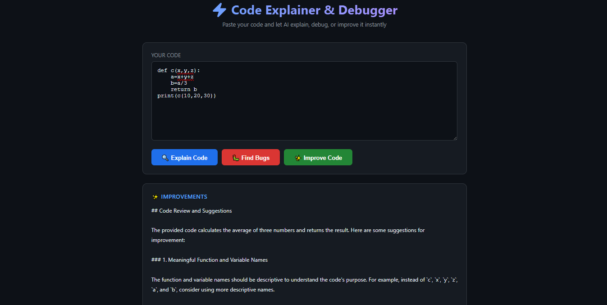
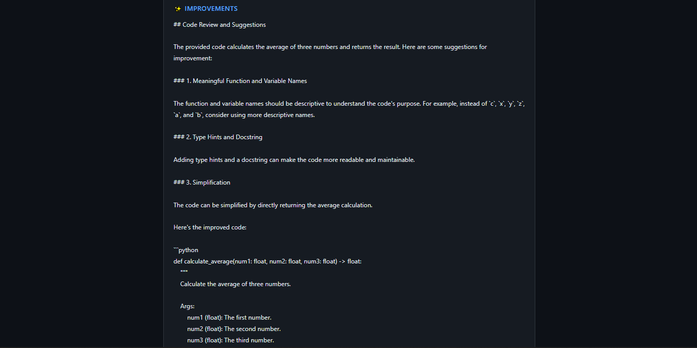
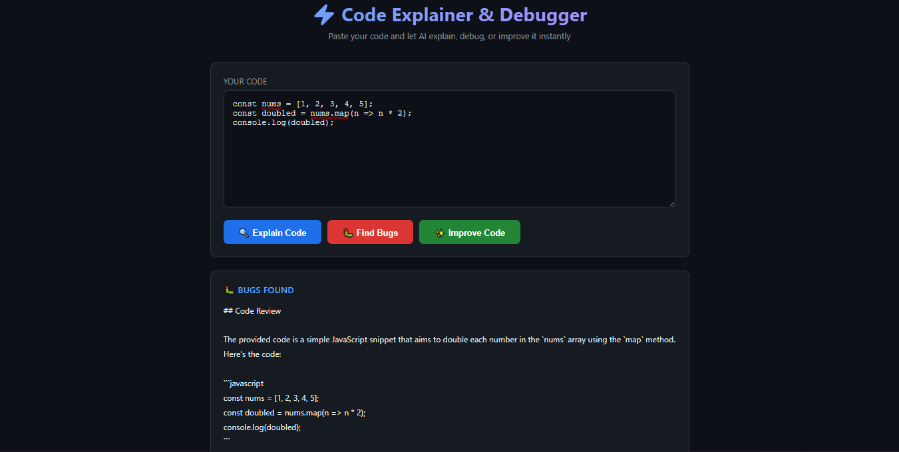
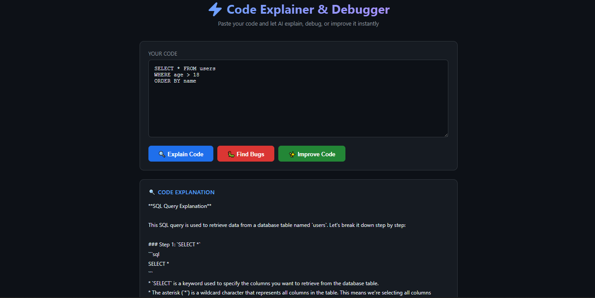

# ⚡ Code Explainer & Debugger

[](https://www.python.org/downloads/)
[](https://fastapi.tiangolo.com)
[](https://groq.com)
[](https://railway.app)
[](LICENSE)

> Paste any code and let AI explain, debug, or improve it instantly. Built with FastAPI and powered by Groq's free Llama 3.3-70B model.

🔗 **[Live Demo](https://web-production-917cb.up.railway.app/)**

---

## 📸 App Preview

> A clean, dark-themed web interface where developers paste code and get instant AI-powered analysis.

### 🖥️ Main Interface



---

## 🧪 Test Case Screenshots

### 🐍 Python — Code Improvement


### 🌐 JavaScript — Bugs Found


### 🗄️ SQL — Code Explanation


---

## ✨ Features

- 🔍 **Code Explanation** - Step-by-step breakdown of what your code does
- 🐛 **Bug Finder** - Detects errors, edge cases, and potential issues with fixes
- ✨ **Code Improver** - Suggests better patterns, performance improvements, and best practices
- 🌐 **Multi-Language Support** - Works with Python, JavaScript, SQL, and more
- ⚡ **Lightning Fast** - Powered by Groq's ultra-fast inference engine
- 🆓 **100% Free** - Uses Groq's free API tier
- 🎨 **Clean UI** - GitHub-inspired dark theme, fully responsive

---

## 🎯 Demo

### Sample Input
```python
def fibonacci(n):
    if n <= 1:
        return n
    return fibonacci(n-1) + fibonacci(n-2)

print(fibonacci(10))
```

### Output
✨ AI provides:
- Step-by-step explanation of the recursive logic
- Bug detection (inefficiency, no input validation)
- Improved version using dynamic programming with O(n) complexity

🔗 **[Try it Live](https://web-production-917cb.up.railway.app/)**

---

## 🛠️ Tech Stack

| Technology | Purpose |
|------------|---------|
| **Python 3.8+** | Core programming language |
| **FastAPI** | Backend web framework |
| **Uvicorn** | ASGI server |
| **Groq API** | AI model inference (Llama 3.3-70B) |
| **HTML/CSS/JS** | Frontend interface |
| **python-dotenv** | Environment variable management |
| **Railway** | Cloud deployment |

---

## 🚀 Installation & Setup

### 1️⃣ Clone the Repository

```bash
git clone https://github.com/smebad/Code-Explainer.git
cd Code-Explainer
```

### 2️⃣ Create Virtual Environment

**Windows:**
```bash
python -m venv .venv
.venv\Scripts\activate
```

**Mac/Linux:**
```bash
python3 -m venv .venv
source .venv/bin/activate
```

### 3️⃣ Install Dependencies

```bash
pip install -r requirements.txt
```

### 4️⃣ Set Up Environment Variables

Create a `.env` file in the root directory:

```env
GROQ_API_KEY=your_actual_groq_api_key_here
```

### 5️⃣ Run the Application

```bash
uvicorn main:app --reload
```
---

## 📖 Usage Guide

### Step 1: Paste Your Code
Copy any code snippet into the text area — Python, JavaScript, SQL, or any language.

### Step 2: Choose an Action

| Button | What it does |
|--------|-------------|
| 🔍 **Explain Code** | Breaks down the logic step by step |
| 🐛 **Find Bugs** | Identifies errors and provides fixed code |
| ✨ **Improve Code** | Suggests optimizations and best practices |

### Step 3: Read the AI Analysis
Results appear instantly below with detailed, beginner-friendly explanations.

---

## 📁 Project Structure

```
Code-Explainer/
│
├── main.py              ← FastAPI backend (API endpoints & Groq integration)
├── requirements.txt     ← Python dependencies
├── Procfile             ← Deployment configuration
├── .env                 ← Secret API keys (never committed to Git)
├── .gitignore           ← Git ignore rules
├── assets/              ← Screenshots of test cases
└── static/
    └── index.html       ← Frontend UI (HTML, CSS, JavaScript)
```

---

## 🔧 API Reference

### POST `/analyze`

Analyzes code using AI.

**Request Body:**
```json
{
  "code": "your code here",
  "action": "explain"
}
```

**Actions:**
- `explain` — Step-by-step code explanation
- `debug` — Bug detection and fixes
- `improve` — Optimization suggestions

**Response:**
```json
{
  "result": "AI-generated analysis here..."
}
```

---

## 🌐 Deployment

This app is deployed on **Railway** for free.

---

## 🧪 Test Cases

The app has been tested with:

| Test | Language | Result |
|------|----------|--------|
| Fibonacci recursion | Python | ✅ |
| Division by zero bug | Python | ✅ |
| Array map function | JavaScript | ✅ |
| SELECT query | SQL | ✅ |
| Empty input validation | — | ✅ |

---

## 🤝 Contributing

Contributions are welcome! Here's how:

1. **Fork the repository**
2. **Create a feature branch**
   ```bash
   git checkout -b feature/AmazingFeature
   ```
3. **Commit your changes**
   ```bash
   git commit -m 'Add some AmazingFeature'
   ```
4. **Push to the branch**
   ```bash
   git push origin feature/AmazingFeature
   ```
5. **Open a Pull Request**

### Ideas for Contributions
- 🎨 Syntax highlighting for code input
- 📋 Copy button for AI responses
- 🌍 Support for more programming languages
- 📄 Export analysis as PDF
- 🕓 Analysis history/session storage
- 🔐 Rate limiting per user

---

## 🐛 Known Issues & Limitations

- **Rate Limits**: Groq free tier has usage limits per minute
- **Cold Starts**: Railway free tier may have slow initial load after inactivity
- **Context Length**: Very large code files may be truncated

---

## 📝 Roadmap

- [ ] 🎨 Syntax highlighting in the code editor
- [ ] 📋 One-click copy for AI responses
- [ ] 🕓 Session history to revisit past analyses
- [ ] 🌍 Multi-language UI support
- [ ] 📄 Export analysis as PDF
- [ ] 🔐 User authentication
- [ ] 📊 Usage analytics dashboard
- [ ] 🤖 Support for multiple AI models

---

## 📄 License

This project is licensed under the MIT License.

```
MIT License

Copyright (c) 2026 Syed Muhammad Ebad

Permission is hereby granted, free of charge, to any person obtaining a copy
of this software and associated documentation files (the "Software"), to deal
in the Software without restriction, including without limitation the rights
to use, copy, modify, merge, publish, distribute, sublicense, and/or sell
copies of the Software, and to permit persons to whom the Software is
furnished to do so, subject to the following conditions:

The above copyright notice and this permission notice shall be included in all
copies or substantial portions of the Software.

THE SOFTWARE IS PROVIDED "AS IS", WITHOUT WARRANTY OF ANY KIND, EXPRESS OR
IMPLIED, INCLUDING BUT NOT LIMITED TO THE WARRANTIES OF MERCHANTABILITY,
FITNESS FOR A PARTICULAR PURPOSE AND NONINFRINGEMENT. IN NO EVENT SHALL THE
AUTHORS OR COPYRIGHT HOLDERS BE LIABLE FOR ANY CLAIM, DAMAGES OR OTHER
LIABILITY, WHETHER IN AN ACTION OF CONTRACT, TORT OR OTHERWISE, ARISING FROM,
OUT OF OR IN CONNECTION WITH THE SOFTWARE OR THE USE OR OTHER DEALINGS IN THE
SOFTWARE.
```

---

## 👤 Author

**Syed Muhammad Ebad**

- 💼 LinkedIn: [linkedin.com/in/syed-ebad-ml](https://linkedin.com/in/syed-ebad-ml)
- 🐙 GitHub: [@smebad](https://github.com/smebad)
- 📧 Email: mohammdedbad1@hotmail.com

---

## 🌟 Show Your Support

If you found this project helpful:

- ⭐ **Star this repository**
- 🐛 **Report bugs** via [Issues](https://github.com/smebad/Code-Explainer/issues)
- 💡 **Suggest features** via [Issues](https://github.com/smebad/Code-Explainer/issues)
- 📢 **Share with others** who might find it useful

---

## 📞 Support & Contact

- 📬 **Open an issue**: [GitHub Issues](https://github.com/smebad/Code-Explainer/issues)
- 📧 **Email me**: mohammdedbad1@hotmail.com
- 💼 **Connect on LinkedIn**: [Syed Ebad](https://linkedin.com/in/syed-ebad-ml)

---

## 🔖 Tags

`code-explainer` `ai` `fastapi` `groq` `llama` `python` `debugging` `code-review` `developer-tools` `generative-ai` `web-app` `railway` `backend`

---

<div align="center">

**Made with ❤️ by [Syed Ebad](https://github.com/smebad)**

[⬆ Back to Top](#-code-explainer--debugger)

</div>